# 03 - Pipeline Flow (Fluxo de Processamento)

> **Navegação:** [← Architecture](02-architecture.md) | [OCR Engines →](04-ocr-engines.md)

---

## 📑 Índice

1. [Visão Geral do Pipeline](#visão-geral-do-pipeline)
2. [Fase 1: Pré-processamento](#fase-1-pré-processamento)
3. [Fase 2: Multi-OCR](#fase-2-multi-ocr)
4. [Fase 3: Extração](#fase-3-extração)
5. [Fase 4: Validação](#fase-4-validação)
6. [Fase 5: Decisão](#fase-5-decisão)
7. [Tratamento de Erros](#tratamento-de-erros)

---

## 🔄 Visão Geral do Pipeline

```mermaid
graph TD
    A[Input: Screenshot] --> B[Pré-processamento]
    B --> C[Multi-OCR]
    C --> D[Votação]
    D --> E[Extração]
    E --> F{Confiança >= 85%?}
    F -->|Sim| G[Auto-aprovado]
    F -->|Não| H[Revisão Humana]
    G --> I[JSON + Nome]
    H --> J[Correção]
    J --> K[Feedback Loop]
    K --> I
```



### Métricas de Performance

| Fase | Tempo Médio | Range | Impacto no Total |
|------|-------------|-------|------------------|
| Pré-processamento | 300ms | 200-500ms | 12% |
| Multi-OCR | 1800ms | 1500-2500ms | 72% |
| Extração | 150ms | 100-250ms | 6% |
| Validação | 100ms | 50-200ms | 4% |
| Storage | 150ms | 100-300ms | 6% |
| **TOTAL** | **2500ms** | **2000-3500ms** | **100%** |

---

## 🖼️ Fase 1: Pré-processamento

### Objetivo
Melhorar a qualidade da imagem para maximizar a acurácia do OCR.

### Fluxograma
```
Input Image
    │
    ▼
┌─────────────────────┐
│ Análise de Qualidade│
│ • Resolução         │
│ • Brilho/Contraste  │
│ • Rotação           │
│ • Nitidez           │
└──────────┬──────────┘
           │
           ▼
     ┌─────────┐
     │ Rotação?│
     └────┬────┘
     Sim  │  Não
      ▼   │   ▼
    Rotate│  Skip
      └───┼───┘
          ▼
    ┌───────────┐
    │Normalização│
    │ • Resize  │
    │ • Contrast│
    └─────┬─────┘
          ▼
    ┌──────────┐
    │  Nitidez  │
    │ • Sharpen│
    └─────┬────┘
          ▼
    ┌──────────┐
    │Denoise   │
    │ • Median │
    └─────┬────┘
          ▼
   Enhanced Image
```

### Implementação Detalhada

#### 1.1 Análise de Qualidade
```javascript
class QualityAnalyzer {
  async analyze(image) {
    const metadata = await image.metadata();
    
    const quality = {
      resolution: this.checkResolution(metadata),
      brightness: await this.analyzeBrightness(image),
      contrast: await this.analyzeContrast(image),
      rotation: await this.detectRotation(image),
      sharpness: await this.analyzeSharpness(image),
      noise: await this.analyzeNoise(image)
    };
    
    return {
      score: this.calculateQualityScore(quality),
      needsRotation: Math.abs(quality.rotation) > 2,
      needsEnhancement: quality.contrast < 0.6 || quality.sharpness < 0.5,
      needsDenoising: quality.noise > 0.3,
      ...quality
    };
  }
  
  checkResolution(metadata) {
    const { width, height } = metadata;
    const pixels = width * height;
    
    if (pixels < 500000) return 0.4;      // < 0.5MP: Baixa
    if (pixels < 2000000) return 0.7;     // < 2MP: Média
    return 1.0;                            // >= 2MP: Boa
  }
  
  async analyzeBrightness(image) {
    const { data, info } = await image
      .greyscale()
      .raw()
      .toBuffer({ resolveWithObject: true });
    
    const avg = data.reduce((sum, val) => sum + val, 0) / data.length;
    return avg / 255; // 0 = escuro, 1 = claro
  }
  
  async detectRotation(image) {
    // Detecta usando metadados EXIF primeiro (rápido)
    const metadata = await image.metadata();
    if (metadata.orientation) {
      return this.exifToRotation(metadata.orientation);
    }
    
    // Se não houver EXIF, usa detecção visual (lento)
    return await this.visualRotationDetection(image);
  }
}
```

#### 1.2 Pipeline de Melhorias
```javascript
class ImageEnhancer {
  async enhance(imagePath, quality) {
    const image = sharp(imagePath);
    let pipeline = image;
    
    // 1. Rotação (se necessário)
    if (quality.needsRotation) {
      pipeline = pipeline.rotate(quality.rotation);
      console.log(`Rotating ${quality.rotation}°`);
    }
    
    // 2. Redimensionamento (normaliza para OCR)
    const metadata = await image.metadata();
    if (metadata.height !== 1920) {
      pipeline = pipeline.resize(null, 1920, {
        kernel: sharp.kernel.lanczos3,
        fit: 'inside'
      });
      console.log(`Resizing to height 1920px`);
    }
    
    // 3. Melhoria de contraste
    if (quality.needsEnhancement) {
      pipeline = pipeline.normalize();
      console.log('Normalizing contrast');
    }
    
    // 4. Nitidez
    if (quality.sharpness < 0.7) {
      pipeline = pipeline.sharpen({
        sigma: 1.5,
        m1: 0.7,
        m2: 0.7
      });
      console.log('Applying sharpening');
    }
    
    // 5. Redução de ruído
    if (quality.needsDenoising) {
      pipeline = pipeline.median(3);
      console.log('Applying noise reduction');
    }
    
    return await pipeline.toBuffer();
  }
}
```

### Casos Edge

#### Imagem Muito Escura
```javascript
if (quality.brightness < 0.3) {
  pipeline = pipeline.modulate({
    brightness: 1.3,  // +30% brilho
    saturation: 1.0
  });
}
```

#### Imagem Muito Clara
```javascript
if (quality.brightness > 0.8) {
  pipeline = pipeline.modulate({
    brightness: 0.85,  // -15% brilho
    saturation: 1.0
  });
}
```

#### Imagem Muito Grande (>16MP)
```javascript
const MAX_PIXELS = 16000000;
if (metadata.width * metadata.height > MAX_PIXELS) {
  const scale = Math.sqrt(MAX_PIXELS / (metadata.width * metadata.height));
  pipeline = pipeline.resize(
    Math.floor(metadata.width * scale),
    Math.floor(metadata.height * scale)
  );
}
```

---

## 🔍 Fase 2: Multi-OCR

### Objetivo
Extrair texto com máxima confiança usando 3 engines e votação.

### Fluxograma
```
Enhanced Image
     │
     ├─────────┬─────────┬─────────┐
     ▼         ▼         ▼         ▼
┌──────────┐┌──────────┐┌──────────┐
│Tesseract ││ EasyOCR  ││  Paddle  │
│  (Node)  ││ (Python) ││ (Python) │
└────┬─────┘└────┬─────┘└────┬─────┘
     │           │           │
     └───────────┼───────────┘
                 ▼
         ┌──────────────┐
         │Circuit Breaker│
         │  Check       │
         └──────┬───────┘
                ▼
         ┌──────────────┐
         │ Agrupa por   │
         │ Posição      │
         │ Espacial     │
         └──────┬───────┘
                ▼
         ┌──────────────┐
         │ Votação      │
         │ Consensus    │
         └──────┬───────┘
                ▼
         OCR Consensus
```

### Implementação Detalhada

#### 2.1 Execução Paralela
```javascript
class MultiOCREngine {
  async extractAll(image) {
    console.log('Starting Multi-OCR extraction...');
    
    const startTime = Date.now();
    
    // Executa em paralelo com tratamento individual de erros
    const results = await Promise.allSettled([
      this.runTesseract(image),
      this.runEasyOCR(image),
      this.runPaddleOCR(image)
    ]);
    
    const elapsed = Date.now() - startTime;
    console.log(`Multi-OCR completed in ${elapsed}ms`);
    
    // Separa sucessos e falhas
    const successful = [];
    const failed = [];
    
    results.forEach((result, index) => {
      const engineName = ['tesseract', 'easyocr', 'paddle'][index];
      
      if (result.status === 'fulfilled') {
        successful.push({
          engine: engineName,
          data: result.value
        });
      } else {
        failed.push({
          engine: engineName,
          error: result.reason.message
        });
        console.error(`${engineName} failed:`, result.reason.message);
      }
    });
    
    // Precisa de pelo menos 1 engine funcionando
    if (successful.length === 0) {
      throw new Error('All OCR engines failed');
    }
    
    // Log de status
    console.log(`OCR Engines: ${successful.length}/${results.length} succeeded`);
    
    // Aplica votação
    return this.applyConsensus(successful);
  }
}
```

#### 2.2 Circuit Breaker
```javascript
class CircuitBreaker {
  constructor(threshold = 5, timeout = 60000) {
    this.failures = 0;
    this.threshold = threshold;
    this.timeout = timeout;
    this.state = 'CLOSED'; // CLOSED, OPEN, HALF_OPEN
    this.openedAt = null;
  }
  
  async execute(fn) {
    // Se aberto, verifica se é hora de tentar novamente
    if (this.state === 'OPEN') {
      if (Date.now() - this.openedAt > this.timeout) {
        this.state = 'HALF_OPEN';
        console.log('Circuit breaker: HALF_OPEN');
      } else {
        throw new Error('Circuit breaker is OPEN');
      }
    }
    
    try {
      const result = await fn();
      this.onSuccess();
      return result;
    } catch (error) {
      this.onFailure();
      throw error;
    }
  }
  
  onSuccess() {
    this.failures = 0;
    if (this.state === 'HALF_OPEN') {
      this.state = 'CLOSED';
      console.log('Circuit breaker: CLOSED (recovered)');
    }
  }
  
  onFailure() {
    this.failures++;
    if (this.failures >= this.threshold) {
      this.state = 'OPEN';
      this.openedAt = Date.now();
      console.error('Circuit breaker: OPEN (too many failures)');
    }
  }
}
```

#### 2.3 Sistema de Votação
```javascript
class ConsensusVoting {
  applyConsensus(ocrResults) {
    // 1. Combina todos os textos
    const allTexts = ocrResults.flatMap(r => r.data.texts);
    
    // 2. Agrupa por proximidade espacial
    const clusters = this.clusterByPosition(allTexts, 50); // threshold 50px
    
    // 3. Vota dentro de cada cluster
    const consensus = clusters.map(cluster => {
      const votes = {};
      
      cluster.forEach(item => {
        const normalized = this.normalizeText(item.text);
        if (!votes[normalized]) {
          votes[normalized] = {
            count: 0,
            items: []
          };
        }
        votes[normalized].count++;
        votes[normalized].items.push(item);
      });
      
      // Seleciona mais votado
      const winner = Object.entries(votes)
        .sort((a, b) => b[1].count - a[1].count)[0];
      
      const confidence = winner[1].count / cluster.length;
      const avgBbox = this.averageBbox(winner[1].items);
      
      return {
        text: winner[0],
        confidence: confidence,
        votes: winner[1].count,
        total: cluster.length,
        bbox: avgBbox
      };
    });
    
    return consensus;
  }
  
  clusterByPosition(texts, threshold) {
    const clusters = [];
    
    texts.forEach(text => {
      let added = false;
      
      for (const cluster of clusters) {
        const distance = this.spatialDistance(text.bbox, cluster[0].bbox);
        
        if (distance < threshold) {
          cluster.push(text);
          added = true;
          break;
        }
      }
      
      if (!added) {
        clusters.push([text]);
      }
    });
    
    return clusters;
  }
  
  spatialDistance(bbox1, bbox2) {
    const center1 = {
      x: (bbox1.left + bbox1.right) / 2,
      y: (bbox1.top + bbox1.bottom) / 2
    };
    
    const center2 = {
      x: (bbox2.left + bbox2.right) / 2,
      y: (bbox2.top + bbox2.bottom) / 2
    };
    
    return Math.sqrt(
      Math.pow(center1.x - center2.x, 2) +
      Math.pow(center1.y - center2.y, 2)
    );
  }
  
  normalizeText(text) {
    return text
      .trim()
      .toLowerCase()
      .replace(/\s+/g, ' ')
      .replace(/[^\w\s.-]/g, '');
  }
}
```

---

## 📝 Fase 3: Extração

### Objetivo
Extrair dados estruturados (data, remetente, mensagens) do OCR.

### Fluxograma
```
OCR Consensus
     │
     ├─────────┬─────────┬─────────┐
     ▼         ▼         ▼         ▼
  ┌──────┐ ┌────────┐ ┌─────────┐
  │ Data │ │Remetente│ │Mensagens│
  └──┬───┘ └───┬────┘ └────┬────┘
     │         │           │
     ▼         ▼           ▼
  5 Estratégias│        Block
     │      Pattern     Detection
     │      Detection      │
     ▼         ▼           ▼
  ML Predict  Layout   Time+Body
     │      Classifier  Association
     │         │           │
     └─────────┼───────────┘
               ▼
         Structured Data
```

### 3.1 Extração de Data

#### Estratégia 1: Banner Visual
```javascript
class DateExtractor {
  extractFromBanner(ocrResults) {
    // Procura blocos no topo (y < 400)
    const topBlocks = ocrResults.filter(r => r.bbox.top < 400);
    
    for (const block of topBlocks) {
      // Padrões comuns de data
      const patterns = [
        /hoje\s*[-—–]\s*(\d{1,2})\s+de\s+(\w+)/i,
        /(\d{1,2})\s+de\s+(\w+)(?:\s+de\s+(\d{4}))?/i,
        /(segunda|terça|quarta|quinta|sexta|sábado|domingo)[^,]*,\s*(\d{1,2})\s+de\s+(\w+)/i
      ];
      
      for (const pattern of patterns) {
        const match = block.text.match(pattern);
        if (match) {
          const parsed = this.parseMatch(match);
          if (this.isValidDate(parsed)) {
            return {
              date: parsed,
              confidence: 0.95,
              method: 'banner_detection',
              source: block.text
            };
          }
        }
      }
    }
    
    return null;
  }
}
```

#### Estratégia 2: Metadata do Arquivo
```javascript
extractFromFilename(filename) {
  // Screenshot_20250609-031245.png → 06-09-2025
  const patterns = [
    /(\d{4})(\d{2})(\d{2})/,        // YYYYMMDD
    /(\d{4})-(\d{2})-(\d{2})/,      // YYYY-MM-DD
    /(\d{2})-(\d{2})-(\d{4})/       // DD-MM-YYYY
  ];
  
  for (const pattern of patterns) {
    const match = filename.match(pattern);
    if (match) {
      const parsed = this.parseFilenameDate(match);
      if (this.isValidDate(parsed)) {
        return {
          date: parsed,
          confidence: 0.85,
          method: 'filename_extraction'
        };
      }
    }
  }
  
  return null;
}
```

#### Estratégia 3: ML Predictivo
```javascript
async predictDate(context) {
  const model = await this.loadModel();
  
  // Extrai features
  const features = this.extractFeatures(context);
  
  // Predição
  const tensor = tf.tensor2d([features]);
  const prediction = await model.predict(tensor);
  const [month, day, year] = await prediction.array();
  
  tensor.dispose();
  prediction.dispose();
  
  const date = this.formatDate(month[0], day[0], year[0]);
  
  return {
    date: date,
    confidence: 0.75,
    method: 'ml_prediction'
  };
}
```

### 3.2 Extração de Remetente

```javascript
class SenderExtractor {
  extract(ocrResults) {
    const strategies = [
      this.extractFromHeader(ocrResults),
      this.extractByPattern(ocrResults),
      this.extractByLayout(ocrResults)
    ];
    
    const candidates = strategies.filter(s => s !== null);
    
    if (candidates.length === 0) {
      return { value: 'UNKNOWN', confidence: 0 };
    }
    
    // Seleciona melhor candidato
    const best = candidates.sort((a, b) => {
      if (Math.abs(a.confidence - b.confidence) < 0.1) {
        return a.bbox.top - b.bbox.top; // Prefere topo
      }
      return b.confidence - a.confidence;
    })[0];
    
    return best;
  }
  
  extractFromHeader(ocrResults) {
    // Busca no topo (y < 200)
    const header = ocrResults.filter(r => r.bbox.top < 200);
    
    if (header.length > 0) {
      // Pega o texto mais ao topo
      const topmost = header.sort((a, b) => a.bbox.top - b.bbox.top)[0];
      
      return {
        value: this.cleanSenderName(topmost.text),
        confidence: 0.90,
        method: 'header_detection',
        bbox: topmost.bbox
      };
    }
    
    return null;
  }
  
  extractByPattern(ocrResults) {
    const patterns = [
      /^\d{4,5}$/,           // Shortcode: 12345
      /^[A-Z][a-z]+$/,       // Nome: Banco
      /^[A-Z]{3,}$/,         // Sigla: UBER
      /^\+?\d{10,15}$/       // Telefone: +5511999999999
    ];
    
    for (const result of ocrResults) {
      for (const pattern of patterns) {
        if (pattern.test(result.text.trim())) {
          return {
            value: result.text.trim(),
            confidence: 0.80,
            method: 'pattern_match',
            bbox: result.bbox
          };
        }
      }
    }
    
    return null;
  }
}
```

### 3.3 Extração de Mensagens

```javascript
class MessageExtractor {
  async extract(ocrResults, date) {
    // 1. Identifica blocos de mensagem
    const blocks = this.identifyMessageBlocks(ocrResults);
    
    // 2. Associa horários
    const messages = this.associateTimes(blocks);
    
    // 3. Valida e limpa
    const validMessages = messages
      .filter(m => this.validateMessage(m))
      .map(m => ({
        hora: m.time,
        corpo: this.cleanMessageBody(m.body),
        data: date,
        confidence: m.confidence
      }));
    
    // 4. Ordena por horário
    return this.sortByTime(validMessages);
  }
  
  identifyMessageBlocks(ocrResults) {
    // Agrupa textos próximos verticalmente
    const sorted = [...ocrResults].sort((a, b) => a.bbox.top - b.bbox.top);
    const blocks = [];
    let currentBlock = [];
    let lastBottom = 0;
    
    sorted.forEach(result => {
      const gap = result.bbox.top - lastBottom;
      
      // Gap > 80px = novo bloco
      if (gap > 80 && currentBlock.length > 0) {
        blocks.push(currentBlock);
        currentBlock = [];
      }
      
      currentBlock.push(result);
      lastBottom = result.bbox.bottom;
    });
    
    if (currentBlock.length > 0) {
      blocks.push(currentBlock);
    }
    
    return blocks;
  }
  
  associateTimes(blocks) {
    const timePattern = /^(\d{1,2}):(\d{2})$/;
    const messages = [];
    
    blocks.forEach(block => {
      let time = null;
      let bodyParts = [];
      
      block.forEach(item => {
        if (timePattern.test(item.text.trim())) {
          time = item.text.trim();
        } else {
          bodyParts.push(item.text);
        }
      });
      
      if (time && bodyParts.length > 0) {
        messages.push({
          time: time,
          body: bodyParts.join(' ').trim(),
          confidence: this.calculateMessageConfidence(block)
        });
      }
    });
    
    return messages;
  }
  
  validateMessage(message) {
    // Valida horário
    const [hour, minute] = message.time.split(':').map(Number);
    if (hour < 0 || hour > 23 || minute < 0 || minute > 59) {
      return false;
    }
    
    // Valida corpo
    if (message.body.length < 3) return false;
    if (message.body.length > 1000) return false;
    
    // Verifica legibilidade (mín 40% caracteres válidos)
    const validChars = [...message.body].filter(c => 
      /[\p{L}\p{N}\p{Emoji}\s]/u.test(c)
    );
    
    return validChars.length / [...message.body].length >= 0.4;
  }
}
```

---

## ✅ Fase 4: Validação

### 4.1 Schema Validator
```javascript
class SchemaValidator {
  validate(extraction) {
    const ajv = new Ajv();
    const schema = require('./schemas/extraction.schema.json');
    
    const isValid = ajv.validate(schema, extraction);
    
    return {
      isValid,
      issues: ajv.errors || [],
      score: isValid ? 1.0 : 0.0
    };
  }
}
```

### 4.2 Business Rules
```javascript
class BusinessRulesValidator {
  validate(extraction) {
    const issues = [];
    let score = 1.0;
    
    // Regra 1: Data não pode ser futura
    const extractedDate = new Date(this.parseDate(extraction.dataReal));
    const now = new Date();
    
    if (extractedDate > now) {
      issues.push({
        type: 'FUTURE_DATE',
        severity: 'ERROR',
        message: 'Data está no futuro'
      });
      score -= 0.3;
    }
    
    // Regra 2: Mensagens devem ter horários sequenciais no mesmo dia
    const times = extraction.mensagens.map(m => m.hora);
    if (!this.areTimesSequential(times)) {
      issues.push({
        type: 'NON_SEQUENTIAL_TIMES',
        severity: 'WARNING',
        message: 'Horários não estão em ordem'
      });
      score -= 0.1;
    }
    
    // Regra 3: Remetente não pode ser vazio
    if (!extraction.remetente || extraction.remetente === 'UNKNOWN') {
      issues.push({
        type: 'MISSING_SENDER',
        severity: 'WARNING',
        message: 'Remetente não identificado'
      });
      score -= 0.2;
    }
    
    return {
      isValid: score >= 0.7,
      issues,
      score: Math.max(0, score)
    };
  }
}
```

---

## 🚦 Fase 5: Decisão

```javascript
class DecisionEngine {
  decide(extraction) {
    const confidence = extraction.metadata.confidence.overall;
    
    if (confidence >= 85) {
      return {
        action: 'AUTO_APPROVE',
        reason: 'High confidence',
        needsReview: false
      };
    } else if (confidence >= 70) {
      return {
        action: 'REVIEW_RECOMMENDED',
        reason: 'Acceptable confidence',
        needsReview: true
      };
    } else {
      return {
        action: 'REVIEW_REQUIRED',
        reason: 'Low confidence',
        needsReview: true
      };
    }
  }
}
```

---

## ⚠️ Tratamento de Erros

### Retry Logic
```javascript
async processWithRetry(image, maxRetries = 3) {
  for (let attempt = 1; attempt <= maxRetries; attempt++) {
    try {
      return await this.process(image);
    } catch (error) {
      if (attempt === maxRetries) {
        throw error;
      }
      
      const backoff = 1000 * Math.pow(2, attempt - 1);
      console.warn(`Retry ${attempt}/${maxRetries} after ${backoff}ms`);
      await this.sleep(backoff);
    }
  }
}
```

---

**Próximo:** [04-ocr-engines.md](04-ocr-engines.md) - Integração OCR Engines